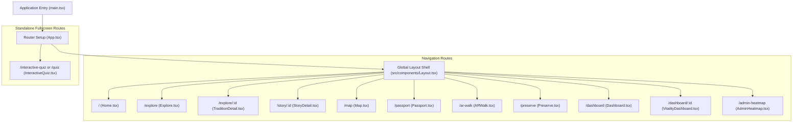

# Dharohar — Complete Technical & Product Documentation

> **Positioning:** *"India's first bottom-up living cultural knowledge engine and vulnerability tracker — not another static heritage catalog."*

---

## 1. Executive Summary & Project Purpose

### What is Dharohar?
**Dharohar** is an interactive web platform built to safeguard, map, and celebrate India's tangible and intangible cultural heritage. Unlike existing top-down government portals (such as the Indian Culture Portal, Vastra Shilpa Kosh, or Incredible India) that function as static museums or destination catalogs, Dharohar is designed as a **living, community-authored cultural knowledge engine and risk-monitoring platform**.

It addresses a critical, time-sensitive national problem: **the rapid loss of indigenous oral traditions, dying folk arts, undocumented languages/scripts, and traditional craftsmanship as elderly culture bearers pass away without their knowledge being captured**.

### Key Differentiators & USPs
1. **Heritage Vulnerability Index (HVI)**: A data-driven mathematical model calculating the risk level of living traditions facing extinction, enabling policymakers (AICTE, Ministry of Culture, ASI) to direct urgent field teams.
2. **Bottom-Up Living Archive**: Direct crowdsourcing portal allowing community members, students, and researchers to record elders and master artisans with dialect-preserving voice capture.
3. **Cryptographic Provenance Passport**: Digital certificates and scannable QR verification for authentic handicrafts (combating power-loom fakes and protecting GI-registered clusters).
4. **Spatio-Temporal Discovery Map**: Interactive Leaflet map featuring historical boundary overlays (e.g., pre-1947 undivided Punjab) and Partition migration pathways.
5. **Simulated AR Heritage Walk & "Ask This Place"**: Immersive camera-viewfinder experience that lets users explore monuments with a multilingual "Ghost Guide" and conversational historical persona.
6. **NEP 2020 & Vidya Daan Alignment**: Academic credit integration for students documenting lesser-known local monuments and traditions.
7. **Gamified Cultural Learning**: Multi-category, multi-tier quiz platform testing architectural, musical, culinary, and folk tradition knowledge.

---

## 2. Tech Stack & Engineering Architecture

| Layer | Technology | Version | Purpose |
|---|---|---|---|
| **Runtime & Core** | React | 19.0.0 | Modern declarative UI component model |
| **Language** | TypeScript | 5.7.0 | Strict static typing and code reliability |
| **Build & Dev Tooling** | Vite | 8.0.5 | Ultra-fast HMR and ESM bundling |
| **Package Manager** | pnpm | Locked via `pnpm-lock.yaml` | Fast, deterministic package management |
| **Styling** | Tailwind CSS v4 | 4.0.0 (`@tailwindcss/vite`) | Utility-first CSS engine with modern theme setup |
| **Routing** | React Router | 8.3.1 | Client-side routing with nested layout routes |
| **Animations** | Framer Motion | 13.2.0 | Smooth scroll-reveal effects and interactive transitions |
| **Mapping Engine** | Leaflet + React-Leaflet | 1.9.4 / 5.0.0 | Open-source interactive spatial mapping and custom SVG pins |
| **Icons** | Lucide React | 1.46.0 | Semantic SVG icons |
| **Utility Libraries** | `clsx`, `tailwind-merge` | 2.1.1 / 3.7.0 | Conditional class handling and Tailwind conflict resolution |

---

## 3. Application Flow & Routing Architecture



---

## 4. File-by-File Breakdown & Functionality

### Root Configuration Files

- **[`package.json`](file:///d:/Dharohar%20website%20prototype/package.json)**: Defines project metadata, dependencies (React 19, Leaflet, Framer Motion, React Router v8), dev tooling (`@tailwindcss/vite`, Vite 8, TypeScript 5.7), and scripts (`dev`, `build`, `preview`, `format`).
- **[`vite.config.ts`](file:///d:/Dharohar%20website%20prototype/vite.config.ts)**: Configures Vite with the `@vitejs/plugin-react` plugin and Tailwind CSS v4 (`@tailwindcss/vite`). Configures path alias `@` mapping to `./src`.
- **[`tsconfig.json`](file:///d:/Dharohar%20website%20prototype/tsconfig.json)**: Configures TypeScript compiler settings (`target: ES2022`, `moduleResolution: Bundler`, JSX preset `react-jsx`, strict typing).
- **[`index.html`](file:///d:/Dharohar%20website%20prototype/index.html)**: The single-page HTML host document containing `#root` and pointing to `/src/main.tsx`. Pre-configures fonts and viewport settings.
- **[`README.md`](file:///d:/Dharohar%20website%20prototype/README.md)**: Overview documentation covering platform features, technical stack, and repository instructions.
- **[`.gitignore`](file:///d:/Dharohar%20website%20prototype/.gitignore) & [`.gitattributes`](file:///d:/Dharohar%20website%20prototype/.gitattributes)**: Rules for ignoring builds (`dist/`, `node_modules/`, `.vite/`) and tracking large binary media using Git LFS.
- **[`.mise.toml`](file:///d:/Dharohar%20website%20prototype/.mise.toml)**: Pins local development toolchain versions for Node.js and pnpm.

---

### Core Application Entry (`src/`)

- **[`src/main.tsx`](file:///d:/Dharohar%20website%20prototype/src/main.tsx)**: The JavaScript entry point. Imports global styling `src/index.css`, grabs `#root` from `index.html`, and mounts `App.tsx` using `createRoot`.
- **[`src/index.css`](file:///d:/Dharohar%20website%20prototype/src/index.css)**: Global CSS file utilizing Tailwind CSS v4 `@import "tailwindcss";`. Defines custom color variables (`parchment`, `ink`, `maroon`, `terracotta`, `turmeric`, `heritage`, `alert`), utility drop-shadow styles (`card-shadow`), and custom scrollbar tweaks.
- **[`src/App.tsx`](file:///d:/Dharohar%20website%20prototype/src/App.tsx)**: Configures client-side routing using `createBrowserRouter` from React Router v8. Defines the top-level parent route using `Layout` and nested children routes (`/`, `map`, `passport`, `ar-walk`, `dashboard`, `preserve`, `explore`, etc.), plus standalone paths for the quiz.
- **[`src/vite-env.d.ts`](file:///d:/Dharohar%20website%20prototype/src/vite-env.d.ts)**: Ambient type declarations for Vite client modules and asset imports.

---

### Shared Components (`src/components/`)

- **[`src/components/Layout.tsx`](file:///d:/Dharohar%20website%20prototype/src/components/Layout.tsx)**:
  - **Role**: Global application wrapper component.
  - **Header/Navbar**: Brand title "Dharohar धरोहर", primary navigation links (Explore, Map, AR Walk, Passport, Quiz, Preserve, Dashboard), and a quick CTA button. Includes a responsive mobile hamburger drawer.
  - **Outlet**: Houses nested views dynamically via `<Outlet />`.
  - **Footer**: Cultural mission statement, thematic links, copyright, and emergency preservation contact.
- **[`src/components/Reveal.tsx`](file:///d:/Dharohar%20website%20prototype/src/components/Reveal.tsx)**:
  - **Role**: Reusable animation component leveraging Framer Motion.
  - **Mechanism**: Wraps child elements in a `motion.div` that listens to viewport visibility, triggering a subtle upward glide (`y: 20 -> 0`) and fade-in (`opacity: 0 -> 1`) with customizable delays.

---

### Application Pages (`src/pages/`)

#### 1. [`src/pages/Home.tsx`](file:///d:/Dharohar%20website%20prototype/src/pages/Home.tsx) — Landing & Discovery Hub
- **Purpose**: The primary landing experience setting the warm, urgent archival tone.
- **Key Sections**:
  - *Hero Section*: High-contrast typography ("Preserve the voices that carry our heritage") paired with vernacular bilingual echoes in Hindi ("विरासत की आवाज़ों को सहेजें"), background photography, and CTAs ("Explore the Archive", "Record a Story").
  - *Live Telemetry Strip*: Metrics ticker displaying 1,420+ stories preserved, 380 traditions documented, 42 dialects recorded, and 910 tradition bearers.
  - *Three Pillars*: Preserve (Oral & living history), Discover (Spatio-temporal mapping), Pass On (Apprenticeships & micro-learning).
  - *5-Step Preservation Lifecycle*: Numbered interactive walkthrough explaining how an elder's recording transitions from audio capture to AI transcription, knowledge graph construction, consent review, and permanent preservation.
  - *Featured Stories Showcase*: Grid of curated stories with category tags, timestamps, and community verification indicators.

#### 2. [`src/pages/Explore.tsx`](file:///d:/Dharohar%20website%20prototype/src/pages/Explore.tsx) — Living Archive Explorer
- **Purpose**: Catalog and search interface for browsing preserved traditions, songs, and memories.
- **Features**:
  - Full-width search bar with predictive suggestions.
  - Filter pills for categories: *All*, *Oral History*, *Craft & Tradition*, *Folk Song*, *Living Tradition*.
  - Multi-parameter filter dropdowns: Region (Punjab, Delhi, Haryana), Language (Hindi, Punjabi, English, Urdu), and Verification Status (*Community Reviewed*, *AI-assisted*).
  - Responsive Card Grid with audio duration timers, geographical origins, and transition hover states.
  - "Documented Traditions" bottom section linking directly to vitality monitoring dashboards.

#### 3. [`src/pages/TraditionDetail.tsx`](file:///d:/Dharohar%20website%20prototype/src/pages/TraditionDetail.tsx) — In-Depth Tradition Profile
- **Purpose**: Comprehensive deep-dive on an individual living craft/tradition (showcasing Phulkari embroidery).
- **Features**:
  - Hero banner with Gurmukhi (`ਫੁਲਕਾਰੀ`) and Devanagari (`फूलों का काम`) script typography.
  - Audio playback widget ("Voice from the Archive") featuring Bibi Surjit Kaur with a 3-tab transcript switcher (Original Punjabi, Hindi, and English).
  - "Materials & Technique" 6-card specification matrix (Khaddar base, Pat silk floss, darn stitch, Bagh geometric patterns, generational transmission).
  - Sticky right-rail profile: Practitioner count (~210), archived stories count (34), UNESCO status, and a direct link to the quantitative Vitality Dashboard.

#### 4. [`src/pages/StoryDetail.tsx`](file:///d:/Dharohar%20website%20prototype/src/pages/StoryDetail.tsx) — Oral Archive Profile
- **Purpose**: Displays the profile of a single preserved audio record (e.g., Partition memories, artisan narratives).
- **Features**:
  - Audio waveform player with playback scrubber and timestamp tracking.
  - Contributor attribution (recording volunteer, elder name, community verification status).
  - Multi-script transcript with synchronized translation tabs.
  - Knowledge graph extraction callout highlighting linked entities (Wikidata QIDs, geographical coordinates, historical period).

#### 5. [`src/pages/Map.tsx`](file:///d:/Dharohar%20website%20prototype/src/pages/Map.tsx) — Spatio-Temporal Heritage Map
- **Purpose**: Geospatial discovery interface powered by Leaflet.
- **Features**:
  - Centered on North-Western India (Punjab, Haryana, Delhi, Rajasthan).
  - Custom color-coded map pins for each category (Blue: Oral History, Terracotta: Crafts, Green: Folk Songs, Gold: Living Traditions).
  - Polyline migration paths illustrating Partition movements (e.g., Lahore to Amritsar).
  - Interactive marker popups revealing story summaries, audio links, and location metadata.
  - Filter drawer allowing users to isolate specific craft clusters or folklore locations.

#### 6. [`src/pages/Passport.tsx`](file:///d:/Dharohar%20website%20prototype/src/pages/Passport.tsx) — Provenance & Craft Authenticity Passport
- **Purpose**: Digital traceability and anti-counterfeiting passport for authentic Indian handicrafts.
- **Features**:
  - GI-registered verification certificate (e.g., Kanchipuram Silk handwoven by Meenakshi Ammal).
  - Tamper-evident certificate ID (`DHR-8492-KNC-2024`) with an interactive QR code.
  - Provenance details: Geographic origin, Korvai handloom weaving technique, pure mulberry silk specifications, and linked oral artisan interviews.
  - Anti-scraping watermark badge protecting artisan audio from unauthorized AI model harvesting.

#### 7. [`src/pages/ARWalk.tsx`](file:///d:/Dharohar%20website%20prototype/src/pages/ARWalk.tsx) — Simulated AR Monument Walk
- **Purpose**: Spatial exploration interface simulating augmented reality overlays on historical landmarks (e.g., Hawa Mahal, Jaipur).
- **Features**:
  - Viewfinder UI with corner targeting brackets, status chips ("AR Overlay Detected"), and interactive focal hotspots.
  - Multilingual "Ghost Guide" audio narration button (Hindi, English, Punjabi).
  - Tabbed contextual panel:
    - *Story*: Architectural symbolism and lore.
    - *History*: Royal lineage and construction background.
    - *Ask*: Interactive conversational agent answering questions grounded in historical facts.

#### 8. [`src/pages/Preserve.tsx`](file:///d:/Dharohar%20website%20prototype/src/pages/Preserve.tsx) — Crowdsourced Voice Recording Portal
- **Purpose**: The 4-step wizard for capturing and submitting oral stories and indigenous traditions.
- **Workflow**:
  1. *Story Type*: Categorization (Craft, Oral History, Folklore, Folk Music).
  2. *Record*: Voice capture interface with live waveform simulation, recording timer, and domain lexicon active indicator (recognizing regional craft terminology).
  3. *Review*: AI entity extraction preview, bilingual transcript validation, and NEP 2020 student credit selection.
  4. *Preserve*: Consent confirmation complying with the Digital Personal Data Protection (DPDP) Act 2023, issuing a permanent archive ID.

#### 9. [`src/pages/Dashboard.tsx`](file:///d:/Dharohar%20website%20prototype/src/pages/Dashboard.tsx) — Public Heritage Vulnerability Index
- **Purpose**: Public overview of endangered traditions ranked by risk score.
- **Features**:
  - Ranking table tracking living arts (e.g., Koodiyattam in Kerala, Majuli Rogan Art in Gujarat, Phulkari in Punjab).
  - Visual status color codes: Critical ($V < 30$), Vulnerable ($30 \le V \le 50$), and Stable ($V > 50$).
  - Transparent formula display educating visitors on the multi-factor risk assessment.

#### 10. [`src/pages/VitalityDashboard.tsx`](file:///d:/Dharohar%20website%20prototype/src/pages/VitalityDashboard.tsx) — Quantitative Deep-Dive Analytics
- **Purpose**: In-depth analytical telemetry for a selected tradition (e.g., Phulkari).
- **Features**:
  - Donut progress gauge visualizing overall vitality score (`72/100 — Stable`).
  - 5-Axis Spider/Radar graphic visualizing transmission, practitioners, documentation, community interest, and practice frequency.
  - Horizontal bar-chart score comparison.
  - Detailed breakdown cards outlining exact sub-scores and weights.

#### 11. [`src/pages/AdminHeatmap.tsx`](file:///d:/Dharohar%20website%20prototype/src/pages/AdminHeatmap.tsx) — Institutional / Government Telemetry Layer
- **Purpose**: Administrative decision-intelligence portal for bodies like AICTE, ASI, and the Ministry of Culture.
- **Features**:
  - High-contrast dark-mode interface with regional risk heatmaps.
  - Telemetry decay curves indicating generational practitioner drop-off.
  - "Direct Field Documentation Team" action trigger for dispatching student/researcher clusters to high-risk zones.
  - Report printing and CSV data export functionality.

#### 12. [`src/pages/InteractiveQuiz.tsx`](file:///d:/Dharohar%20website%20prototype/src/pages/InteractiveQuiz.tsx) — Gamification & Trivia Engine
- **Purpose**: Comprehensive gamified learning hub containing 1,000+ lines of interactive logic.
- **Features**:
  - 4 Distinct Categories: Rhythms & Ragas (Music), Architectural Marvels (Heritage sites), Culinary Roots (Traditional recipes), and Living Traditions & Lore (Crafts & rituals).
  - Difficulty modes: "Seeker" (Casual explorer) and "Historian" (Deep scholar).
  - Timed question cards with immediate visual feedback (correct/incorrect states).
  - "Cultural Insight" drawer on every question providing deep educational context, history, and trivia.
  - Final results scorecard showing streak count, accuracy percentage, and earned cultural badges.

---

## 5. Mathematical Models & Scientific Formulations

### The Heritage Vulnerability Index (HVI)
Dharohar replaces subjective assessments with an objective, weighted multi-factor formula to calculate the survival index of any intangible tradition:

$$V = 0.30 \cdot T + 0.25 \cdot P + 0.20 \cdot D + 0.15 \cdot C + 0.10 \cdot F$$

Where:
- **$T$ (Generational Transmission — 30%)**: Measures whether younger generations are actively learning the art or oral history.
- **$P$ (Active Practitioners Count — 25%)**: Census of living master artisans, singers, or storytellers.
- **$D$ (Documentation Depth — 20%)**: Extent of high-fidelity audio, video, and written archival records.
- **$C$ (Community Interest & Awareness — 15%)**: Search volume, youth engagement, and public cultural awareness.
- **$F$ (Practice Frequency — 10%)**: Frequency of ritualistic or commercial execution (daily, seasonal, or rare).

#### Risk Classification Tiers:
- **$V < 30$ (Critical / Alert Rust)**: Immediate extinction risk within 5–10 years. Triggers urgent institutional field deployment.
- **$30 \le V \le 50$ (At Risk / Turmeric Gold)**: Rapidly declining practitioner base. Requires micro-apprenticeship support.
- **$V > 50$ (Stable / Heritage Green)**: Active community practice and healthy generational transmission.

---

## 6. Design System & Aesthetic Tokens

The design language mimics a warm, physical archival ledger with tactile warmth rather than a cold corporate tech product:

- **Background (Parchment)**: `#F3ECDA` / `#FBF7EE` — warm handmade paper aesthetic.
- **Typography & Body (Ink)**: `#241B1D` — warm near-black with brown undertones.
- **Headings & Structure (Maroon)**: `#7A1F35` — regal, grounded heritage color.
- **Primary CTAs (Terracotta)**: `#C9622E` — earthen pottery warmth for active interactions.
- **Highlight Badges (Turmeric Gold)**: `#C68A1D` — applied to AI tags, alert accents, and badges.
- **Verified Status (Heritage Green)**: `#3E6B4F` — reserved exclusively for community-reviewed, authentic content.
- **Critical Risk (Alert Rust)**: `#A83E22` — high-urgency indicator on vulnerability meters.
- **Typography**: Display serif headings (Fraunces / Playfair style) for archival character paired with clean humanist sans-serif for UI clarity, supplemented by native Devanagari and Gurmukhi companion scripts.

---

## 7. How to Run & Developer Guidelines

### Development Server
```bash
# Run using pnpm (never use npm or n8n)
pnpm dev
```
The Vite development server runs on default port `8443` or `5173` with instant Hot Module Replacement (HMR).

### Production Build
```bash
pnpm build
pnpm preview
```
Outputs optimized static assets to `dist/`.
